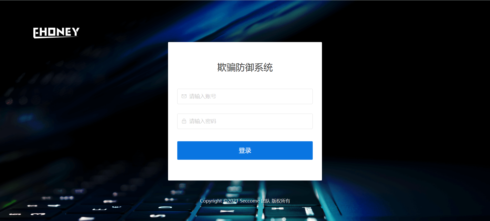

# Ehoney快速使用指南

## 使用说明

1. 登录系统。
   
   1. 默认登录地址即成功安装后提示地址，如http://192.168.22.176:8080/decept-defense
   
   2. 默认账号admin，密码123456。
   
   
2. 新建蜜罐
   1. 进入"蜜罐管理"->"蜜罐列表"页面，点击新建。
   
   2. 输入蜜罐名称(小写字母+数字)、选择镜像类型，点击添加。如:蜜罐名称tomcat，镜像类型为103.39.213.38/ehoney/tomcat:v1。
   
   3. 等待蜜罐新增成功。(第一次要从harbor拉去镜像，可能耗时3分钟)。
   
      验证：列表中状态显示“在线”；点击网络探测显示蜜罐正常运行中。
	  
	  
	  
3. 部署密签和诱饵(非必须)
   1. 进入"蜜罐管理"->"蜜罐列表"->"密签列表"，新建选择密签类型(当前仅支持file类型)和密签文件以及部署位置。

      验证： 列表中状态显示“创建成功”;点击下载后，用office软件打开后在列表上点击详情，展示打开文件的跟踪记录。
	  
	  
	  

   2. 进入"蜜罐管理"->"蜜罐列表"->"诱饵列表"，新建选择诱饵类型和诱饵文件以及部署位置。

      验证： 列表中状态显示“创建成功”;
	  

4. 部署探针服务器(非必须)

   1. 点击右上角的下载支持，将压缩包拷贝到即将部署的服务器上。
   
   2. 解压文件tar -zxvf decept-agent.tar.gz
   
   3. 修改解压目录中的conf目录下的agent.json，修改strategyAddr参数ip为redis地址的ip，默认安装为当前服务器ip。修改sshKeyUploadUrl的ip尾web服务的ip，默认安装为当前服务器ip。
   
   4. 执行 chmod +x decept-agent &&  ./decept-agent -mode=EDGE
   
   5. 查看启动日志和探针列表是否有此探针服务确认启动是否正常。
   
   

5. 建立协议转发

   1. 进入"影子代理"->"协议转发"，选择服务类型(即第2步中新建蜜罐的类型)，选择蜜罐及转发端口(端口范围:0-65535 )。

      验证：列表中状态显示“创建成功”;点击网络探测显示正常。
	 
	 

6. 建立透明转发

   1. 新建转发选择蜜罐、协议转发端口、要新建转发的探针主机、转发的蜜罐和端口以及透明转发端口(端口范围:0-65535 )。

      验证：列表中状态显示“创建成功”;点击网络探测显示正常; 模拟攻击产生攻击日志，具体请参考[这里](https://www.showdoc.com.cn/1432924569255366/7002140661722605)
	  
   
   
## 进阶使用指南
### 镜像源配置
   1. 搭建好本地或公网上harbor，并上传镜像到harbor项目里。具体可以参考:[搭建企业级私有仓库harbor-V2.0并上传镜像](https://bbs.huaweicloud.com/blogs/196221)

   2. 进入镜像源配置，填写harbor地址、用户名、密码、项目名称。

   验证：进入镜像列表，列表一刷新，显示自定义蜜罐镜像。

### 镜像列表
  1.  默认seccome harbor源镜像无法修改。
  
  2.  点击编辑可以修改自定义蜜罐端口(诱导黑客攻击的端口)、蜜罐类型(协议代理类型)、操作系统类型。

### 密签配置
注意：密签跟踪地址理论上要设置成公网IP地址，端口5000。测试环境可以使用默认地址不需要修改。
