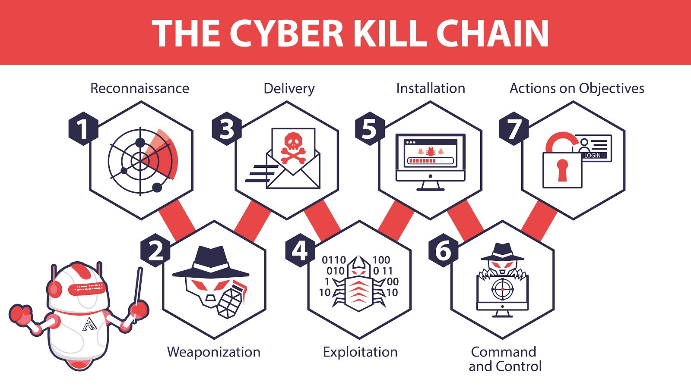

# 什么是Ehoney
e签宝安全团队积累十几年的安全经验，都将对外逐步开放，首开的Ehoney欺骗防御系统，该系统是基于云原生的欺骗防御系统，也是业界唯一开源的对标商业系统的产品，欺骗防御系统通过部署高交互高仿真蜜罐及流量代理转发，再结合自研密签及诱饵，将攻击者攻击引导到蜜罐中达到扰乱引导以及延迟攻击的效果，可以很大程度上保护业务的安全。护网必备良药。

# 什么是欺骗防御
《孙子兵法》说，兵者，诡道也。从古至今，欺骗技术就作为战场上一种积极防御策略被一直使用。而网络欺骗技术，就是信息安全战场上防御者的“诡计”。Gartner在2016年安全与风险管理峰会的10大信息安全技术中，就提出了欺骗技术，Gartner对网络欺骗技术的定义为：使用骗局或者假动作来阻挠或者推翻攻击者的认知过程，扰乱攻击者的自动化工具，延迟或阻断攻击者的活动，通过使用虚假的响应、 有意的混淆、以及假动作、误导等伪造信息达到“欺骗”的目的。 欺骗技术(Deception Technology )已连续三年被Gartner列为十大安全技术之一， Gartner 认为，未来 5-10 年，欺骗技术将成为主流安全产品对抗未知威胁、0day攻击、高级可持续攻击等的安全问题的最佳解决方案。

# 解决的问题

 

`Cyber​​ Kill Chain 不仅仅是一种攻击模型。Cyber​​ Kill Chain 的七个阶段为任何组织的安全设计提供了极好的基础。`

- **侦察追踪**
攻击者收集有关其目标的信息。这包括间接和被动方法，攻击者通过这些方法从 ARIN（美国互联网号码注册机构）注册、Shodan 或工作列表等公共资源中收集信息。然后攻击者将转向更直接和主动的方法，例如端口扫描。
- **武器构建**
攻击者现在利用侦察中发现的漏洞发起攻击；许多利用来自 metasploit、exploit-db 或社会工程工具包的工具。
- **载荷投递**
一旦攻击者选择了最适合利用您的漏洞的工具，他们就会选择传送方法，无论是网络钓鱼电子邮件、受感染的 USB 还是其他选择的方法。
- **漏洞利用**
武器已交付。攻击者只需要执行攻击，它可以采用 SQL 注入、缓冲区溢出、RCE 以及无数其他形式。
- **安装植入**
攻击者获得更好的访问权限。常见的对抗技术包括在无文件攻击中执行 powershell、安装远程访问工具 (RAT) 和 DLL 劫持。
- **持续控制**
攻击者现在设置对您的系统的持久访问以进行远程操作。根据他们的最终目标，攻击者可以立即采取行动，也可以潜伏在您的系统中数月到数年。即使在重新启动或修补初始漏洞后，访问仍可能持续存在，并且通常被加密和屏蔽以使其看起来像正常流量。有时，它甚至嵌入在正常的合法流量中，例如 Twitter 或电子邮件。
- **目标达成**
攻击者实现他们的入侵目标，例如数据泄露、数据破坏或拒绝服务。

`然而，正如网络安全中的一句老话，“防御者需要防御一切，而攻击者只需要利用一个弱点。”，师以长夷以制夷，我们也可以用黑客的手段，反制黑客，打造一套覆盖整个攻击链的欺骗体系`

# 与蜜罐的不同：
- **仿真环境**
也就是大家理解的蜜罐，现在市场主流的蜜罐分高中低三类，诉求和解决的问题也不一样，如果要真实模拟环境，高交互蜜罐最合适，实现起来也更复杂，但是市面大部分蜜罐都低交互，稍微有点经验的黑客就能识破，何来欺骗！

- **覆盖率**
蜜罐是被动放在那里，等待黑客自己进来，比如线上服务器1w台，你不可能去部署1w台蜜罐，如果蜜罐仅仅部署几台，犹如杯水车薪，防御效果可想而知，所以这个是欺骗防御必须要解决的问题，就是如何做到高效的请君入瓮

- **攻击溯源**
如果采用高交互蜜罐，黑客入侵进去以后，怎么记录所有黑客的攻击，在蜜罐里装监控，黑客很容易就能发现，而且还能kill该监控，一般黑客都是攻击脚本不落盘，木马程序直接内存运行，没有办法拿到黑客样本，溯源非常困难

- **动态对抗**
蜜罐仅仅只能对攻击进行溯源，分析，不能做到根据黑客的行为，预测黑客的下一步，做到防范于未然，这个不仅仅是分析能力不足，蜜罐的架构也是没法实现动态对抗

- **安全风险**
黑客入侵蜜罐，如果蜜罐没做任何网络隔离，可能就会通过蜜罐做横向渗透测试

# e签宝欺骗防御技术点
- **云原生**
轻量级k3s，满足容器管理，这样在一台机器上，可以构造无限制(受限机器配置)的仿真环境，有云原生的一切能力，而且还可以应用云原生自身的安全能力可以监控容器，如falco监控容器并且捕获攻击脚本，k3s防火墙限制只有容器之间互通，跟外界网络都是不通，解决了安全风险问题
- **代理技术**
代理分为透明代理，协议代理，透明代理部署在业务服务器上，解决了蜜罐覆盖率不够的问题，这样业务服务器仅仅安装透明代理，就可以把攻击流量牵引到蜜罐中，协议代理是建立在透明代理和k3s容器之间的桥梁，所有流量都通过协议代理转到对应的k3s容器中，这样既可以记录所有攻击请求，又可以让黑客毫无感知

- **诱饵(honeybit)** 
黑客进入蜜罐，一般会做横向渗透测试，上图供给链也已经描述，比如黑客会查看history等，诱饵就是在history等地方插入蜜罐的信息，这样黑客攻击又会进入下一个蜜罐，环环相扣，仿佛进入迷宫一样

- **密签(honeytoken)**
黑客入侵主要还是拿到你的数据，但是大部分不知道数据是否泄露，如果黑客拿到数据，一打开数据就能定位黑客在哪，他是谁，是不是就能闭环，所以密签是整个欺骗防护的精华，所以其实密签可以是单独一个数据泄露产品，e签宝安全团队后续准备在单独开放出来

- **机器学习**
此处暂不做过多赘述，这是实现动态对抗蜜罐的核心，技术还在内部测试当中
#e签宝欺骗防御系统的特性：

- **支持丰富的蜜罐类型**
> 通用蜜罐： SSH 蜜罐、Http蜜罐、Redis蜜罐、Telnet蜜罐、Mysql蜜罐、RDP 蜜罐
> IOT蜜罐：  RTSP 蜜罐
> 工控蜜罐： ModBus 蜜罐

- **基于云原生技术**
> 基于k3s打造saas平台欺骗防御，无限生成蜜罐，真实仿真业务环境

- **业内独一无二密签技术**
> 独创的密签技术，支持20多种密签，如文件、图片，邮件等

- **强大诱饵**
> 支持数十种诱饵，通过探针管理，进行欺骗引流

- **可视化拓扑**
> 可以可视化展示攻击视图，让所有攻击可视化，形成完整的攻击链路

- **动态对抗技术**
> 基于LSTM的预测算法，可以预测黑客下一步攻击手段，动态欺骗，延缓黑客攻击时间，保护真实业务

- **强大的定制化**
> 支持自定义密签、诱饵、蜜罐等，插件化安装部署，满足一切特性需求

# ⛴ 环境准备

- **系统要求**: CentOS 7 及以上
- **最低配置：**: 内存4G、磁盘空间10G以上
- **建议配置：**: 内存8G、磁盘空间30G以上

# 演示视频

# 相关链接
[官网](http://www.seccome.com "官网")
[文档首页](# "文旦首页")
[github](https://github.com/seccome/Ehoney "github地址")

